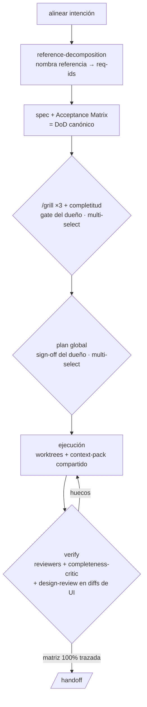

[English](README.md) | **Español**

# 🛠️ claude-code-setup-optimizer

[](https://github.com/davidgarciagordo/claude-code-setup-optimizer) [](https://skills.sh)  

> El hub que optimiza tu forma de trabajar con Claude Code en cualquier repo — metodología + automatizaciones reales + una skill que analiza tu repo y **te deja elegir qué aplicar**.

### 🧩 La familia — misma firma, cuatro repos

| | Repo | Rol |
|---|---|---|
| 🛠️ | [**claude-code-setup-optimizer**](https://github.com/davidgarciagordo/claude-code-setup-optimizer) · *estás aquí* | **El hub** — empaqueta todo lo de abajo + automatizaciones (hooks · subagents · comandos) + `/optimize-my-setup` |
| 🔨 | [**forge-methodology**](https://github.com/davidgarciagordo/forge-methodology) | Estructura *qué construir* — alinear → spec → grill ×3 → plan → verificar |
| 🎨 | [**design-review**](https://github.com/davidgarciagordo/design-review) | Pule *cómo se ve* — estructura → auditoría → anti-slop → a11y → check en vivo |
| 💸 | [**token-economy**](https://github.com/davidgarciagordo/token-economy) | Gasta *menos en hacerlo* — context-pack (descubrir una vez) · agentes read-only terse · output-style frugal · memoria pluggable. Complementa a [caveman](https://github.com/JuliusBrussee/caveman) (salida) en el eje entrada/orquestación. |

## 📦 Instalación

```bash
# 🛠️ Añade el marketplace hub (trae los cinco plugins)
/plugin marketplace add davidgarciagordo/claude-code-setup-optimizer

/plugin install working-methods@claude-code-setup-optimizer
/plugin install automations@claude-code-setup-optimizer
/plugin install forge-methodology@claude-code-setup-optimizer
/plugin install design-review@claude-code-setup-optimizer
/plugin install token-economy@claude-code-setup-optimizer
```
Cada plugin se instala también suelto (forge/design-review son su propio marketplace).

## 🚀 Empieza aquí

El hub tiene una **columna vertebral** — un único entrypoint que *secuencia y enforda* la metodología, para que el orden no viva en un prompt copy-paste que tengas que recordar.

**1. Prepara el taller (una vez):**
```
/install-family        # verifica/instala los 5 plugins como unidad
/optimize-my-setup     # ajusta la config .claude de ESTE repo — tú eliges qué aplicar
```

**2. Construye con la columna (cada tarea sustancial):**
```
/forge-run <tu tarea>
```
`/forge-run` corre el loop entero **en orden CODIFICADO con gates checkeados por máquina**:



> Los gates de decisión del dueño (grill · plan) son **multi-select con recomendadas premarcadas** — nunca
> un aprobar a secas. Un PR no sale hasta que spec + acta del grill + Acceptance Matrix + plan están en disco.

El orden vive en `plugins/working-methods/workflows/forge.js` (fuente única), no en prosa. `forge.js` aplica un **gate de orden de fases** (rechaza ejecuciones huérfanas), **parsea una sola vez** (sin I/O repetido), y es la fuente única para el hook `guard-forge-artifacts` — el hook delega a `forge.js check-pr` y ya no bloquea los `git push` por fase. Cada fase **invoca** el command/skill/agente real — *aplica* `forge-methodology` y `design-review`, no solo recomienda instalarlos. Un PR no sale hasta que el spec, el acta de grill, la Acceptance Matrix y el plan estén versionados en `docs/forge/<slug>/`. **El usuario siempre decide** — el gate del plan (fase 5) es un **multi-select con recomendaciones pre-marcadas** (igual que el gate C del grill), no un simple sign-off.

> `/optimize-my-setup` es **setup del repo** (una vez), no un paso de construir una feature. Agnóstico de lenguaje — JS/TS, Python, PHP, Go, Rust, Ruby.

## 📚 Ejemplos

Uso copy-paste de cada plugin, comando, hook y subagent → [examples/](examples/README.es.md).

## 🧩 Plugins

| Plugin | Origen | Contenido |
|--------|--------|-----------|
| 🧠 `working-methods` | local | **`/forge-run` — LA columna vertebral**: secuencia y fuerza el loop completo (`workflows/forge.js` — gate de orden de fases, parse-once, rechaza ejecuciones huérfanas; `guard-forge-artifacts` delega a `forge.js check-pr`, sin bloqueo de `git push` por fase). · `/install-family` (bootstrap de los 5 plugins) · `/grill` — adversarial ×3 con **agentes griller read-only y terse** (`agents/grill-{architect,operator,engineer}.md`, sin Edit/Write) + **`workflows/grill-context.mjs`** determinista (pack descubierto una vez) + lente **`completeness-critic`** incluida como 4ª lente. · `/handoff` (relevo de sesión) · `forge-on-claude` (mapea Forge a herramientas de Claude Code; **requiere `forge-methodology`**). Routing por modelo integrado. *(comms low-cost → usa el original [caveman](https://github.com/JuliusBrussee/caveman))* |
| ⚡ `automations` | local | **`/optimize-my-setup`** (skill + comando) — **`scan.mjs`** determinista construye un repo→context-pack, luego ejecuta un **fan-out paralelo real read-only por superficie** y presenta un **multi-select de apply** (tú eliges qué adoptar). Optimiza toda la config `.claude`: `CLAUDE.md`, `settings.json` (permisos/hooks/env), skills, **agents generados por invariante detectado**, `workflows/*.js`, `.mcp.json`, `output-styles`. Hook **fail-closed** activo `guard-append-only`. `/release`. **Templates**: hooks parametrizables (`guard-main`, `commit-msg-lint`, `secrets-guard`, `ui-diff-design-review`), templates de reviewers (incl. `completeness-critic` genérico), allow-list de permisos, bloque de rules para CLAUDE.md. |
| 🔨 `forge-methodology` | github | Loop Forja: alinear → spec → grill ×3 → plan global → ejecución → verify vs DoD → sign-off. |
| 🎨 `design-review` | github | Pipeline de diseño/rediseño/auditoría (jerarquía, IA, a11y, tokens, motion). |
| 💸 `token-economy` | github | Máximo ahorro de tokens sin perder calidad: `scripts/context-pack.mjs` (descubrir una vez), plantilla de agente read-only, **output-style frugal**, adapter de memoria pluggable. La familia hereda la economía entrada/salida desde aquí (fuente única). Complementa a `caveman` (salida) en el eje entrada/orquestación. |

## 🙏 Créditos — referencia, no copia

Este marketplace **referencia y organiza** buen trabajo; no vendoriza copias, así todo se mantiene al día en su origen y el crédito queda en sus autores.

- **forge-methodology**, **design-review**, **token-economy** — de [David García Gordo](https://github.com/davidgarciagordo) (esta familia).
- **caveman** (comms low-cost) — de [JuliusBrussee](https://github.com/JuliusBrussee/caveman). Instala el original: `/plugin marketplace add JuliusBrussee/caveman`.
- El **pipeline de design-review** orquesta skills de sus autores originales — `impeccable`, `taste-skill`, `emil-design-eng`, `ui-ux-pro-max`, `huashu-design`, `web-accessibility`, `seo` — instaladas desde su fuente vía el preflight (ver *Attribution* de design-review). Nada bundleado; cada una se actualiza en su origen.

## 📌 Normas always-on

Estilo/testing/seguridad/orquestación son guía **permanente**, no skills on-demand → un plugin no las inyecta en el system prompt. Referéncialas desde el `CLAUDE.md` de cada repo con `plugins/automations/templates/claude-md-rules-reference.md`.

## 🗂️ Estructura
```
.claude-plugin/marketplace.json                  # 4 plugins (2 locales + 2 github)
plugins/working-methods/
  commands/forge-run.md · install-family.md · grill.md · handoff.md
  workflows/forge.js           # máquina de fases determinista — gate de orden, parse-once, rechaza huérfanos
  workflows/grill-context.mjs  # pack de contexto descubierto una vez para /grill
  agents/grill-architect.md · grill-operator.md · grill-engineer.md   # agentes griller read-only terse
  agents/completeness-critic.md   # 4ª lente incluida con /grill
  hooks/guard-forge-artifacts.py   # gate de PR: delega a forge.js check-pr (fail-closed)
  skills/forge-on-claude/
plugins/automations/
  commands/optimize-my-setup.md · release.md
  skills/optimize-my-setup/
    scan.mjs                   # repo→context-pack determinista
  hooks/guard-append-only.py   # fail-closed
  templates/hooks/             # guard-main · commit-msg-lint · secrets-guard · ui-diff-design-review
  templates/reviewers/         # event-bus · i18n · completeness-critic
```
Valida: `claude plugin validate . --strict`.

---
<sub>Hecho por [David García Gordo](https://github.com/davidgarciagordo) · MIT</sub>
