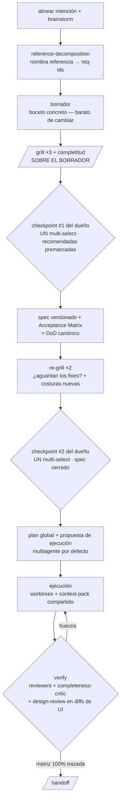

[English](README.md) | **Español**

# 🛠️ claude-code-setup-optimizer

[](https://github.com/davidgarciagordo/claude-code-setup-optimizer) [](https://skills.sh) 

> Dos plugins que optimizan tu forma de trabajar con Claude Code en cualquier repo:
> `working-methods` (la columna `/forge-run` — alinear → borrador + grill ×3 → spec → re-grill ×2 → plan → verificar) y
> `automations` (`/optimize-my-setup`, hooks, `/release`). Parte de una suite de 6 plugins del
> mismo autor — ver [La suite completa](#-la-suite-completa) más abajo.

## 📦 Instalación

`automations` no tiene dependencias, así que se instala desde el marketplace de este repo:

```bash
/plugin marketplace add davidgarciagordo/claude-code-setup-optimizer
/plugin install automations@claude-code-setup-optimizer          # /optimize-my-setup · hooks · /release
```

> ⚠️ Instala `working-methods` desde el catálogo de abajo, **no** desde este marketplace. Declara
> `forge-methodology` y `design-review` como dependencias ancladas al marketplace
> `davidgarciagordo-plugins`; instalado desde aquí sale `✘ failed to load — Dependency
> "forge-methodology@davidgarciagordo-plugins" is not installed`. Desde el catálogo trae las dos
> dependencias y carga `enabled`.

La suite completa (los 6 plugins de David García Gordo) desde un catálogo dedicado:

```bash
/plugin marketplace add davidgarciagordo/claude-plugins
/plugin install working-methods@davidgarciagordo-plugins
/plugin install automations@davidgarciagordo-plugins
/plugin install forge-methodology@davidgarciagordo-plugins
/plugin install design-review@davidgarciagordo-plugins
/plugin install token-economy@davidgarciagordo-plugins
/plugin install swarm@davidgarciagordo-plugins
```

Luego:
```
/reload-plugins        # o reinicia Claude Code — los plugins cargan al arrancar
/optimize-my-setup     # opcional: ajusta la config .claude de ESTE repo — tú eliges qué aplicar
```
Verifica con `/plugin` (o `claude plugin list`): los plugins instalados en `✔ enabled`, sin `Error`.

## 🧩 La suite completa

`/forge-run` (más abajo) invoca `forge-methodology` y `design-review` en las fases correspondientes,
y los agentes de la familia heredan la economía de tokens de `token-economy`. Esos tres plugins —
más `working-methods` y `automations` de este repo, y `swarm` — están catalogados juntos en
[**davidgarciagordo/claude-plugins**](https://github.com/davidgarciagordo/claude-plugins), el
marketplace único y dedicado de toda la familia. Instala desde ahí (arriba) para tener los 6;
instala solo `automations` desde este repo (arriba) si es lo único que quieres.

| | Repo | Rol |
|---|---|---|
| 🔨 | [**forge-methodology**](https://github.com/davidgarciagordo/forge-methodology) | Estructura *qué construir* — alinear → borrador + grill ×3 → spec → re-grill ×2 → plan → verificar (2 checkpoints del dueño, en lote) |
| 🎨 | [**design-review**](https://github.com/davidgarciagordo/design-review) | Pule *cómo se ve* — investigación de referencias → 4 lentes de diseño en paralelo → veredicto en navegador real (`alive`/`templated`/`flat`), impuesto por hook |
| 💸 | [**token-economy**](https://github.com/davidgarciagordo/token-economy) | Gasta *menos en hacerlo* — context-pack (descubrir una vez) · agentes read-only terse · output-style frugal · memoria pluggable. Complementa a [caveman](https://github.com/JuliusBrussee/caveman) (salida) en el eje entrada/orquestación. |
| 🐝 | [**swarm**](https://github.com/davidgarciagordo/swarm) | Un enjambre de 45 agentes separado, no una fase de `/forge-run` — un objetivo entra, y discovery → análisis → diseño (su propio grill ×3) → TDD → entrega salen, con memoria unificada entre fases. |

## 🚀 Cómo se usa

**1. Instala** (arriba), luego:

**2. Construye con la columna (cada tarea sustancial):**
```
/forge-run <tu tarea>
```
`/forge-run` corre el loop entero **en orden CODIFICADO con gates checkeados por máquina**:


```mermaid
flowchart TD
  A[alinear intención + brainstorm] --> R[reference-decomposition<br/>nombra referencia → req-ids]
  R --> D[borrador<br/>boceto concreto — barato de cambiar]
  D --> G[/grill ×3 + completitud<br/>SOBRE EL BORRADOR/]
  G --> C1{checkpoint #1 del dueño<br/>UN multi-select · recomendadas premarcadas}
  C1 --> S[spec versionado + Acceptance Matrix<br/>= DoD canónico]
  S --> RG[re-grill ×2<br/>¿aguantan los fixes? + costuras nuevas]
  RG --> C2{checkpoint #2 del dueño<br/>UN multi-select · spec cerrado}
  C2 --> P[plan global + propuesta de ejecución<br/>multiagente por defecto]
  P --> E[ejecución<br/>worktrees + context-pack compartido]
  E --> V{verify<br/>reviewers + completeness-critic<br/>+ design-review en diffs de UI}
  V -- huecos --> E
  V -- matriz 100% trazada --> H[/handoff/]
```

> Al dueño se le interrumpe **exactamente dos veces** (checkpoint #1 · checkpoint #2), cada una UN
> **multi-select con recomendadas premarcadas** — nunca un aprobar a secas. Un PR no sale hasta que
> spec + Acceptance Matrix + ambas actas de grill + ambos registros de decisiones + plan están en disco.

El orden vive en `plugins/working-methods/workflows/forge.js` (fuente única), no en prosa. `forge.js` aplica un **gate de orden de fases** (no se entra en una fase sin haber pasado por la anterior, e `init` no arranca un segundo run activo), **parsea una sola vez** (sin I/O repetido), y es la fuente única para el hook `guard-forge-artifacts` — el hook delega a `forge.js check-pr` y solo gatea comandos de PR, no `git push`. Cada fase **invoca** el command/skill/agente real — *aplica* `forge-methodology` y `design-review`, no solo recomienda instalarlos. Un PR no sale hasta que el spec, la Acceptance Matrix, las actas de grill y re-grill, ambos registros de decisiones y el plan estén trackeados por git (no vacíos) en `docs/forge/<slug>/`; un `run.json` ilegible también bloquea. **El usuario siempre decide** — en exactamente dos checkpoints (`checkpoint-1` tras el grill del borrador, `checkpoint-2` que cierra el spec), cada uno un **multi-select con recomendaciones pre-marcadas**, no un simple sign-off.

> `/optimize-my-setup` es **setup del repo** (una vez), no un paso de construir una feature. Agnóstico de lenguaje — JS/TS, Python, PHP, Go, Rust, Ruby.

## 📚 Ejemplos

Uso copy-paste de cada plugin, comando, hook y subagent → [examples/](examples/README.es.md).

## 🧩 Plugins

| Plugin | Origen | Contenido |
|--------|--------|-----------|
| 🧠 `working-methods` | local | **`/forge-run` — LA columna vertebral**: secuencia y fuerza el loop completo (`workflows/forge.js` — gate de orden de fases, parse-once, un run activo a la vez; `guard-forge-artifacts` delega a `forge.js check-pr` y solo gatea comandos de PR). · `/install-family` (bootstrap de la suite completa de 5 plugins desde `davidgarciagordo/claude-plugins`) · `/grill` — adversarial ×3 con **agentes griller read-only y terse** (`agents/grill-{architect,operator,engineer}.md`, sin Edit/Write) + **`workflows/grill-context.mjs`** determinista (pack descubierto una vez) + una 4ª lente **`completeness-critic`** que viene de `forge-methodology` (no incluida aquí). · `/handoff` — relevo de sesión, **autónomo en ambas caras**: *propone* el relevo cuando es óptimo (trigger binario: sesión larga **+** bloque cerrado) y, si el owner aprueba, lo *ejecuta en la misma sesión*; **sin humano** (cron/`/loop`/background/`$CLAUDE_JOB_DIR`) *se ejecuta solo y arma la continuación* — un scheduler durable (el skill `schedule` o un cron externo) cuando la siguiente sesión debe arrancar sola; `ScheduleWakeup`/`CronCreate` solo continúan mientras esta sesión vive — escribir el MD del handoff es un checkpoint, no un stop. Regla de oro: **usuario presente → preguntar; sin usuario → ejecutar solo.** · `forge-on-claude` (mapea Forge a herramientas de Claude Code; **requiere `forge-methodology`**). Routing por modelo integrado. *(comms low-cost → usa el original [caveman](https://github.com/JuliusBrussee/caveman))* |
| ⚡ `automations` | local | **`/optimize-my-setup`** (skill) — **`scan.mjs`** determinista construye un repo→context-pack, luego ejecuta un **fan-out paralelo real read-only por superficie** y presenta un **multi-select de apply** (tú eliges qué adoptar). Optimiza toda la config `.claude`: `CLAUDE.md`, `settings.json` (permisos/hooks/env), skills, **agents generados por invariante detectado**, `workflows/*.js`, `.mcp.json`, `output-styles`. Hook **fail-closed** activo `guard-append-only`. `/release`. **Templates**: hooks parametrizables (`guard-main`, `commit-msg-lint`, `secrets-guard`, `ui-diff-design-review`), templates de reviewers (incl. `completeness-critic` genérico), allow-list de permisos, bloque de rules para CLAUDE.md. |

`forge-methodology`, `design-review` y `token-economy` no están en el
marketplace de este repo — ver [La suite completa](#-la-suite-completa) más arriba para qué
hace cada uno y desde dónde instalarlos.

## 🙏 Créditos — referencia, no copia

Este repo **referencia** buen trabajo; no vendoriza copias, así todo se mantiene al día en su origen y el crédito queda en sus autores.

- **forge-methodology**, **design-review**, **token-economy** — de [David García Gordo](https://github.com/davidgarciagordo), catalogados en [`davidgarciagordo/claude-plugins`](https://github.com/davidgarciagordo/claude-plugins).
- **caveman** (comms low-cost) — de [JuliusBrussee](https://github.com/JuliusBrussee/caveman). Instala el original: `/plugin marketplace add JuliusBrussee/caveman`.
- El **pipeline de design-review** orquesta skills de sus autores originales — `impeccable`, `taste-skill`, `emil-design-eng`, `ui-ux-pro-max`, `huashu-design`, `web-accessibility`, `seo` — instaladas desde su fuente vía el preflight (ver *Attribution* de design-review). Nada bundleado; cada una se actualiza en su origen.

## 📌 Normas always-on

Estilo/testing/seguridad/orquestación son guía **permanente**, no skills on-demand → un plugin no las inyecta en el system prompt. Referéncialas desde el `CLAUDE.md` de cada repo con `plugins/automations/templates/claude-md-rules-reference.md`.

## 🗂️ Estructura
```
.claude-plugin/marketplace.json                  # 2 plugins (working-methods, automations)
plugins/working-methods/
  commands/forge-run.md · install-family.md · grill.md · handoff.md
  workflows/forge.js           # máquina de fases determinista — gate de orden, parse-once, un run activo
  workflows/grill-context.mjs  # pack de contexto descubierto una vez para /grill
  agents/grill-architect.md · grill-operator.md · grill-engineer.md   # agentes griller read-only terse
  hooks/guard-forge-artifacts.py   # gate de PR: delega a forge.js check-pr (fail-closed)
  skills/forge-on-claude/
plugins/automations/
  commands/release.md
  skills/optimize-my-setup/
    scan.mjs                   # repo→context-pack determinista
  hooks/guard-append-only.py   # fail-closed
  templates/hooks/             # guard-main · commit-msg-lint · secrets-guard · ui-diff-design-review
  templates/reviewers/         # event-bus · i18n · completeness-critic
```
Valida: `claude plugin validate . --strict`. Tests: `node --test tests/*.test.mjs` (estructura, gates de `forge.js`, scripts y exit codes de los hooks — también en CI).

## ✅ Reglas de manifest (que `/plugin install` no se rompa)

`claude plugin validate` revisa el esquema, **no** que el plugin cargue de verdad — haz siempre un install real antes de publicar:

```bash
CLAUDE_CONFIG_DIR=$(mktemp -d) claude plugin marketplace add ./<repo>   # o owner/repo
CLAUDE_CONFIG_DIR=$(mktemp -d) claude plugin install <name>@<marketplace>
claude plugin list    # debe poner "Status: ✔ enabled", sin "Error: Hook load failed"
```

Dos errores que pasan validación pero rompen install:

- **`agents` / `commands` / `skills`**: usa string de ruta o array de rutas (`"skills": "./"`, `"commands": ["./commands/"]`). Un string de directorio en el campo equivocado se rechaza.
- **`hooks`**: **no** declares `"hooks": "./hooks/hooks.json"`. El `hooks/hooks.json` estándar se **auto-carga**; declararlo otra vez lanza *"Duplicate hooks file detected"* y el plugin no carga. Solo pon `hooks` para ficheros de hook *adicionales*.

Comprobado con un install real en un `CLAUDE_CONFIG_DIR` limpio: `automations` desde este marketplace y `working-methods` desde `davidgarciagordo/claude-plugins` salen `enabled`.

## ⚖️ Licencia

MIT © David García Gordo
