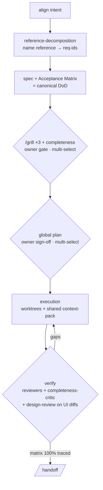

**English** | [Español](README.es.md)

# 🛠️ claude-code-setup-optimizer

[](https://github.com/davidgarciagordo/claude-code-setup-optimizer) [](https://skills.sh)  

> Two plugins that optimise how you work with Claude Code in any repo: `working-methods`
> (the `/forge-run` spine — align → spec → grill ×3 → plan → verify) and `automations`
> (`/optimize-my-setup`, hooks, `/release`). Part of a 5-plugin suite by the same author —
> see [The wider suite](#-the-wider-suite) below.

## 📦 Install

Just this repo's two plugins:

```bash
/plugin marketplace add davidgarciagordo/claude-code-setup-optimizer
/plugin install working-methods@claude-code-setup-optimizer     # /forge-run · /grill · /handoff
/plugin install automations@claude-code-setup-optimizer          # /optimize-my-setup · hooks · /release
```

The whole suite (all 5 plugins by David García Gordo) from one dedicated catalog:

```bash
/plugin marketplace add davidgarciagordo/claude-plugins
/plugin install working-methods@davidgarciagordo-plugins
/plugin install automations@davidgarciagordo-plugins
/plugin install forge-methodology@davidgarciagordo-plugins
/plugin install design-review@davidgarciagordo-plugins
/plugin install token-economy@davidgarciagordo-plugins
```

Then:
```
/reload-plugins        # or restart Claude Code — plugins load at startup
/optimize-my-setup     # optional: tailor this repo's .claude config — you pick what to apply
```
Verify with `/plugin` (or `claude plugin list`): installed plugins show `✔ enabled`, no `Error`.

## 🧩 The wider suite

`/forge-run` (below) invokes `forge-methodology` and `design-review` at the right phases, and
the family's agents inherit token economy from `token-economy`. Those three plugins — plus
this repo's `working-methods` and `automations` — are catalogued together in
[**davidgarciagordo/claude-plugins**](https://github.com/davidgarciagordo/claude-plugins), the
single dedicated marketplace for the whole family. Install from there (above) to get all 5;
install from this repo (above) if you only want `working-methods` + `automations`.

| | Repo | Role |
|---|---|---|
| 🔨 | [**forge-methodology**](https://github.com/davidgarciagordo/forge-methodology) | Structure *what to build* — align → spec → grill ×3 → plan → verify |
| 🎨 | [**design-review**](https://github.com/davidgarciagordo/design-review) | Polish *how it looks* — structure → audit → anti-slop → a11y → live check |
| 💸 | [**token-economy**](https://github.com/davidgarciagordo/token-economy) | Spend *less to do it* — context-pack (discover-once) · read-only terse agents · frugal output-style · pluggable memory. Complements [caveman](https://github.com/JuliusBrussee/caveman) (output) on the input/orchestration axis. |

## 🚀 How to use

**1. Install** (above), then:

**2. Build with the spine (every substantial task):**
```
/forge-run <your task>
```
`/forge-run` runs the whole loop **in codified order with machine-checked gates**:



> Owner-decision gates (grill · plan) are **multi-select with recommendations pre-marked** — never a bare
> approve. A PR can't leave until spec + grill acta + Acceptance Matrix + plan are on disk.

The order lives in `plugins/working-methods/workflows/forge.js` (single source of truth), not
in prose. `forge.js` enforces **phase order** (rejects orphan runs), **parses once** (no
repeated I/O), and is the single source for the `guard-forge-artifacts` hook — the hook
delegates to `forge.js check-pr` and no longer blocks per-phase `git push`. Each phase
**invokes** the real command/skill/agent — it *applies* `forge-methodology` and `design-review`,
it doesn't just recommend installing them. A PR can't leave until the run's spec, grill acta,
Acceptance Matrix and plan are versioned under `docs/forge/<slug>/`. **The owner always
decides** — the plan gate (phase 5) is a **multi-select with recommendations pre-marked**
(same UX as the grill gate C), not a bare sign-off.

> `/optimize-my-setup` is one-time **repo setup**, not a step of building a feature.
> Language-agnostic — JS/TS, Python, PHP, Go, Rust, Ruby.

## 📚 Examples

Copy-paste usage for every plugin, command, hook and subagent → [examples/](examples/README.md).

## 🧩 Plugins

| Plugin | Source | Contents |
|--------|--------|----------|
| 🧠 `working-methods` | local | **`/forge-run` — THE spine**: sequences & enforces the whole loop (`workflows/forge.js` — phase-order gate, parse-once, rejects orphan run; `guard-forge-artifacts` delegates to `forge.js check-pr`, no per-phase `git push` block). · `/install-family` (bootstrap the full suite from `davidgarciagordo/claude-plugins`) · `/grill` — adversarial ×3 with **read-only terse griller agents** (`agents/grill-{architect,operator,engineer}.md`, no Edit/Write) + deterministic **`workflows/grill-context.mjs`** (discover-once pack) + bundled **`completeness-critic`** 4th lens. · `/handoff` (session relay) · `forge-on-claude` (maps Forge to Claude Code tools; **requires `forge-methodology`**). Model routing baked in. *(low-cost comms → pair with the original [caveman](https://github.com/JuliusBrussee/caveman))* |
| ⚡ `automations` | local | **`/optimize-my-setup`** (skill + command) — deterministic **`scan.mjs`** builds a repo→context-pack, then runs **real parallel read-only per-surface fan-out**, and presents a **multi-select apply** (you pick what to adopt). Tailors the whole `.claude` setup: `CLAUDE.md`, `settings.json` (permissions/hooks/env), skills, **agents generated per detected invariant**, `workflows/*.js`, `.mcp.json`, `output-styles`. Active **fail-closed** hook `guard-append-only`. `/release`. **Templates**: parametrizable **hooks** (`guard-main`, `commit-msg-lint`, `secrets-guard`, `ui-diff-design-review`), reviewer templates (incl. generic `completeness-critic`), permissions allow-list, CLAUDE.md rules block. |

`forge-methodology`, `design-review` and `token-economy` are no longer bundled in this
repo's marketplace — see [The wider suite](#-the-wider-suite) above for what each does and
where to install them from.

## 🙏 Credits — referenced, not copied

This repo **references** great work; it does not vendor copies, so everything stays current at its source and the original authors keep the credit.

- **forge-methodology**, **design-review**, **token-economy** — by [David García Gordo](https://github.com/davidgarciagordo), catalogued in [`davidgarciagordo/claude-plugins`](https://github.com/davidgarciagordo/claude-plugins).
- **caveman** (low-cost comms) — by [JuliusBrussee](https://github.com/JuliusBrussee/caveman). Install the original: `/plugin marketplace add JuliusBrussee/caveman`.
- The **design-review pipeline** orchestrates skills by their original authors — `impeccable`, `taste-skill`, `emil-design-eng`, `ui-ux-pro-max`, `huashu-design`, `web-accessibility`, `seo` — installed from source via its preflight (see design-review's *Attribution*). Nothing bundled; each updates at its origin.

## 📌 Always-on norms

Style/testing/security/orchestration are **permanent** guidance, not on-demand skills → a plugin doesn't inject them into the system prompt. Reference them from each repo's `CLAUDE.md` using `plugins/automations/templates/claude-md-rules-reference.md`.

## 🗂️ Structure
```
.claude-plugin/marketplace.json                  # 2 plugins (working-methods, automations)
plugins/working-methods/
  commands/forge-run.md        # THE entrypoint — the codified spine
  commands/install-family.md   # bootstrap the full 5-plugin suite from davidgarciagordo/claude-plugins
  commands/grill.md · handoff.md
  workflows/forge.js           # deterministic phase machine — single source of truth; phase-order gate, parse-once, rejects orphan run
  workflows/grill-context.mjs  # discover-once context pack for /grill
  agents/grill-architect.md · grill-operator.md · grill-engineer.md   # read-only terse griller agents
  agents/completeness-critic.md   # 4th lens bundled with /grill
  hooks/guard-forge-artifacts.py   # PR gate: delegates to forge.js check-pr (fail-closed)
  skills/forge-on-claude/      # requires forge-methodology
plugins/automations/
  commands/optimize-my-setup.md · release.md
  skills/optimize-my-setup/
    scan.mjs                   # deterministic repo→context-pack
  hooks/guard-append-only.py   # fail-closed
  templates/hooks/             # guard-main · commit-msg-lint · secrets-guard · ui-diff-design-review
  templates/reviewers/         # event-bus · i18n · completeness-critic
```
Validate: `claude plugin validate . --strict`.

## ✅ Manifest rules (keep `/plugin install` working)

`claude plugin validate` checks the schema but **not** that the plugin actually loads — always do one real install before publishing:

```bash
CLAUDE_CONFIG_DIR=$(mktemp -d) claude plugin marketplace add ./<repo>   # or owner/repo
CLAUDE_CONFIG_DIR=$(mktemp -d) claude plugin install <name>@<marketplace>
claude plugin list    # must show "Status: ✔ enabled", no "Error: Hook load failed"
```

Two mistakes that pass validation but break install (both bit this repo — fixed):

- **`agents` / `commands` / `skills`**: use a path string or an array of paths (`"skills": "./"`, `"commands": ["./commands/"]`). A bare directory string in the wrong field is rejected.
- **`hooks`**: do **not** declare `"hooks": "./hooks/hooks.json"`. The standard `hooks/hooks.json` is **auto-loaded**; declaring it again throws *"Duplicate hooks file detected"* and the plugin fails to load. Only set `hooks` for *additional* hook files.

Verified: both plugins install clean from scratch via GitHub → `enabled`.

---
<sub>Made by [David García Gordo](https://github.com/davidgarciagordo) · MIT</sub>
