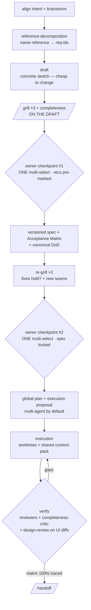

**English** | [Español](README.es.md)

# 🛠️ claude-code-setup-optimizer

[](https://github.com/davidgarciagordo/claude-code-setup-optimizer) [](https://skills.sh) 

> Two plugins that optimise how you work with Claude Code in any repo: `working-methods`
> (the `/forge-run` spine — align → draft + grill ×3 → spec → re-grill ×2 → plan → verify) and `automations`
> (`/optimize-my-setup`, hooks, `/release`). Part of a 6-plugin suite by the same author —
> see [The wider suite](#-the-wider-suite) below.

## 📦 Install

`automations` has no dependencies, so it installs from this repo's own marketplace:

```bash
/plugin marketplace add davidgarciagordo/claude-code-setup-optimizer
/plugin install automations@claude-code-setup-optimizer          # /optimize-my-setup · hooks · /release
```

> ⚠️ Install `working-methods` from the catalog below, **not** from this marketplace. It declares
> `forge-methodology` and `design-review` as dependencies pinned to the `davidgarciagordo-plugins`
> marketplace; installed from here it shows `✘ failed to load — Dependency
> "forge-methodology@davidgarciagordo-plugins" is not installed`. From the catalog it pulls in
> both dependencies and loads enabled.

The whole suite (all 6 plugins by David García Gordo) from one dedicated catalog:

```bash
/plugin marketplace add davidgarciagordo/claude-plugins
/plugin install working-methods@davidgarciagordo-plugins
/plugin install automations@davidgarciagordo-plugins
/plugin install forge-methodology@davidgarciagordo-plugins
/plugin install design-review@davidgarciagordo-plugins
/plugin install token-economy@davidgarciagordo-plugins
/plugin install swarm@davidgarciagordo-plugins
```

Then:
```
/reload-plugins        # or restart Claude Code — plugins load at startup
/optimize-my-setup     # optional: tailor this repo's .claude config — you pick what to apply
```
Verify with `/plugin` (or `claude plugin list`): installed plugins show `✔ enabled`, no `Error`.

## 🧩 The wider suite

`/forge-run` (below) invokes `forge-methodology` and `design-review` at the right phases, and
the family's agents inherit token economy from `token-economy`. Those three plugins — plus
this repo's `working-methods` and `automations`, and `swarm` — are catalogued together in
[**davidgarciagordo/claude-plugins**](https://github.com/davidgarciagordo/claude-plugins), the
single dedicated marketplace for the whole family. Install from there (above) to get all 6;
install `automations` alone from this repo (above) if that's all you want.

| | Repo | Role |
|---|---|---|
| 🔨 | [**forge-methodology**](https://github.com/davidgarciagordo/forge-methodology) | Structure *what to build* — align → draft + grill ×3 → spec → re-grill ×2 → plan → verify (2 batched owner checkpoints) |
| 🎨 | [**design-review**](https://github.com/davidgarciagordo/design-review) | Polish *how it looks* — reference research → 4 parallel design lenses → live-render verdict (`alive`/`templated`/`flat`), enforced by hook |
| 💸 | [**token-economy**](https://github.com/davidgarciagordo/token-economy) | Spend *less to do it* — context-pack (discover-once) · read-only terse agents · frugal output-style · pluggable memory. Complements [caveman](https://github.com/JuliusBrussee/caveman) (output) on the input/orchestration axis. |
| 🐝 | [**swarm**](https://github.com/davidgarciagordo/swarm) | A separate 45-agent development swarm, not a phase of `/forge-run` — one objective in, discovery → analysis → design (its own grill ×3) → TDD → delivery out, with unified memory across phases. |

## 🚀 How to use

**1. Install** (above), then:

**2. Build with the spine (every substantial task):**
```
/forge-run <your task>
```
`/forge-run` runs the whole loop **in codified order with machine-checked gates**:


```mermaid
flowchart TD
  A[align intent + brainstorm] --> R[reference-decomposition<br/>name reference → req-ids]
  R --> D[draft<br/>concrete sketch — cheap to change]
  D --> G[/grill ×3 + completeness<br/>ON THE DRAFT/]
  G --> C1{owner checkpoint #1<br/>ONE multi-select · recs pre-marked}
  C1 --> S[versioned spec + Acceptance Matrix<br/>= canonical DoD]
  S --> RG[re-grill ×2<br/>fixes hold? + new seams]
  RG --> C2{owner checkpoint #2<br/>ONE multi-select · spec locked}
  C2 --> P[global plan + execution proposal<br/>multi-agent by default]
  P --> E[execution<br/>worktrees + shared context-pack]
  E --> V{verify<br/>reviewers + completeness-critic<br/>+ design-review on UI diffs}
  V -- gaps --> E
  V -- matrix 100% traced --> H[/handoff/]
```

> The owner is interrupted **exactly twice** (checkpoint #1 · checkpoint #2), each ONE **multi-select
> batch with recommendations pre-marked** — never a bare approve. A PR can't leave until spec +
> Acceptance Matrix + both grill verdicts + both decision records + plan are on disk.

The order lives in `plugins/working-methods/workflows/forge.js` (single source of truth), not
in prose. `forge.js` enforces **phase order** (a phase can't be entered before its
predecessor, and `init` refuses to start a second active run), **parses once** (no repeated
I/O), and is the single source for the `guard-forge-artifacts` hook — the hook delegates to
`forge.js check-pr` and gates only PR commands, not `git push`. Each phase
**invokes** the real command/skill/agent — it *applies* `forge-methodology` and `design-review`,
it doesn't just recommend installing them. A PR can't leave until the run's spec, Acceptance
Matrix, grill + re-grill verdicts, both decision records and the plan are tracked by git
(non-empty) under `docs/forge/<slug>/`; an unreadable `run.json` also blocks. **The owner always decides** — at exactly two checkpoints
(`checkpoint-1` after the draft grill, `checkpoint-2` locking the spec), each a
**multi-select with recommendations pre-marked**, not a bare sign-off.

> `/optimize-my-setup` is one-time **repo setup**, not a step of building a feature.
> Language-agnostic — JS/TS, Python, PHP, Go, Rust, Ruby.

## 📚 Examples

Copy-paste usage for every plugin, command, hook and subagent → [examples/](examples/README.md).

## 🧩 Plugins

| Plugin | Source | Contents |
|--------|--------|----------|
| 🧠 `working-methods` | local | **`/forge-run` — THE spine**: sequences & enforces the whole loop (`workflows/forge.js` — phase-order gate, parse-once, one active run at a time; `guard-forge-artifacts` delegates to `forge.js check-pr` and gates only PR commands). · `/install-family` (bootstrap the full suite from `davidgarciagordo/claude-plugins`) · `/grill` — adversarial ×3 with **read-only terse griller agents** (`agents/grill-{architect,operator,engineer}.md`, no Edit/Write) + deterministic **`workflows/grill-context.mjs`** (discover-once pack) + a 4th **`completeness-critic`** lens from `forge-methodology` (not bundled here). · `/handoff` — session relay, **autonomous on both sides**: *proposes* the relay when it's optimal (binary trigger: long session **+** closed block) and, once the owner approves, *executes it in-session*; with **no human** (cron/`/loop`/background/`$CLAUDE_JOB_DIR`) it *runs itself and arms the continuation* — a durable scheduler (the `schedule` skill or an external cron) when the next session must start on its own; `ScheduleWakeup`/`CronCreate` only continue while this session is alive — writing the handoff MD is a checkpoint, not a stop. Golden rule: **user present → ask; no user → run solo.** · `forge-on-claude` (maps Forge to Claude Code tools; **requires `forge-methodology`**). Model routing baked in. *(low-cost comms → pair with the original [caveman](https://github.com/JuliusBrussee/caveman))* |
| ⚡ [`automations`](plugins/automations/README.md) | local | **`/optimize-my-setup`** (skill) — deterministic **`scan.mjs`** builds a repo→context-pack, then runs **real parallel read-only per-surface fan-out**, and presents a **multi-select apply** (you pick what to adopt). Tailors the whole `.claude` setup: `CLAUDE.md`, `settings.json` (permissions/hooks/env), skills, **agents generated per detected invariant**, `workflows/*.js`, `.mcp.json`, `output-styles`. Active **fail-closed** hook `guard-append-only`. `/release`. **Templates**: parametrizable **hooks** (`guard-main`, `commit-msg-lint`, `secrets-guard`, `ui-diff-design-review`), reviewer templates (incl. generic `completeness-critic`), permissions allow-list, CLAUDE.md rules block. |

`forge-methodology`, `design-review` and `token-economy` are not in this
repo's marketplace — see [The wider suite](#-the-wider-suite) above for what each does and
where to install them from.

## 🙏 Credits — referenced, not copied

This repo **references** great work; it does not vendor copies, so everything stays current at its source and the original authors keep the credit.

- **forge-methodology**, **design-review**, **token-economy** — by [David García Gordo](https://github.com/davidgarciagordo), catalogued in [`davidgarciagordo/claude-plugins`](https://github.com/davidgarciagordo/claude-plugins).
- **caveman** (low-cost comms) — by [JuliusBrussee](https://github.com/JuliusBrussee/caveman). Install the original: `/plugin marketplace add JuliusBrussee/caveman`.
- The **design-review pipeline** orchestrates skills by their original authors — `impeccable`, `taste-skill`, `emil-design-eng`, `ui-ux-pro-max`, `huashu-design`, `web-accessibility`, `seo` — installed from source via its preflight (see design-review's *Attribution*). Nothing bundled; each updates at its origin.

## 📌 Always-on norms

Style/testing/security/orchestration are **permanent** guidance, not on-demand skills → a plugin doesn't inject them into the system prompt. Reference them from each repo's `CLAUDE.md` using `plugins/automations/templates/claude-md-rules-reference.md`.

## 🗂️ Structure
```
.claude-plugin/marketplace.json                  # 2 plugins (working-methods, automations)
plugins/working-methods/
  commands/forge-run.md        # THE entrypoint — the codified spine
  commands/install-family.md   # bootstrap the full 5-plugin suite from davidgarciagordo/claude-plugins
  commands/grill.md · handoff.md
  workflows/forge.js           # deterministic phase machine — single source of truth; phase-order gate, parse-once, one active run
  workflows/grill-context.mjs  # discover-once context pack for /grill
  agents/grill-architect.md · grill-operator.md · grill-engineer.md   # read-only terse griller agents
  hooks/guard-forge-artifacts.py   # PR gate: delegates to forge.js check-pr (fail-closed)
  skills/forge-on-claude/      # requires forge-methodology
plugins/automations/           # → full docs: plugins/automations/README.md
  commands/release.md
  skills/optimize-my-setup/
    scan.mjs                   # deterministic repo→context-pack
  hooks/guard-append-only.py   # fail-closed
  templates/hooks/             # guard-main · commit-msg-lint · secrets-guard · ui-diff-design-review
  templates/reviewers/         # completeness-critic · ds-adoption · defense-and-coverage · event-bus · i18n
```
Validate: `claude plugin validate . --strict`. Test: `node --test tests/*.test.mjs` (structure, `forge.js` gates, scripts and hook exit codes — also run in CI).

## ✅ Manifest rules (keep `/plugin install` working)

`claude plugin validate` checks the schema but **not** that the plugin actually loads — always do one real install before publishing:

```bash
CLAUDE_CONFIG_DIR=$(mktemp -d) claude plugin marketplace add ./<repo>   # or owner/repo
CLAUDE_CONFIG_DIR=$(mktemp -d) claude plugin install <name>@<marketplace>
claude plugin list    # must show "Status: ✔ enabled", no "Error: Hook load failed"
```

Two mistakes that pass validation but break install:

- **`agents` / `commands` / `skills`**: use a path string or an array of paths (`"skills": "./"`, `"commands": ["./commands/"]`). A bare directory string in the wrong field is rejected.
- **`hooks`**: do **not** declare `"hooks": "./hooks/hooks.json"`. The standard `hooks/hooks.json` is **auto-loaded**; declaring it again throws *"Duplicate hooks file detected"* and the plugin fails to load. Only set `hooks` for *additional* hook files.

Checked with a real install in a fresh `CLAUDE_CONFIG_DIR`: `automations` from this marketplace and `working-methods` from `davidgarciagordo/claude-plugins` both show `enabled`.

## ⚖️ License

MIT © David García Gordo
